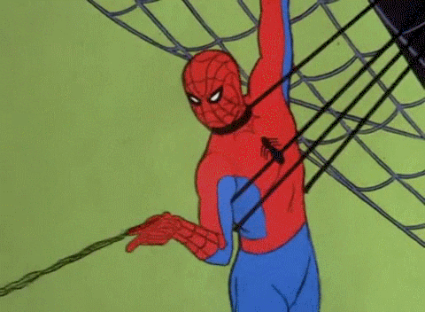

<!DOCTYPE HTML>
<head>
<title> Spidey | Coming Soon </title>
<link rel="icon" type="image/png" href="spider_man_dock_icon_by_meganubis.png" />
 <link rel="stylesheet" href="main.css">
 <link rel="stylesheet" href="https://cdnjs.cloudflare.com/ajax/libs/font-awesome/4.7.0/css/font-awesome.min.css"
       <meta content="Spidey Development="og:title">

<meta content="Spidey Developments | Discord bots, Websites, and Setups" property="og:description">

<meta content="Spidey" property="og:site_name">

<meta content='https://cdn.discordapp.com/attachments/545011761674321940/555903328131743744/spidey.png' property='og:image'>
</head>
<body>
 

<h1> Spidey </h1>
</img>

<h3> spidey#0001 </h3>
<h4 class="button2"><a href="https://auth.carbonmade.com/"> Click Me! Portfolio </a> </h4>

</body>
</html>
